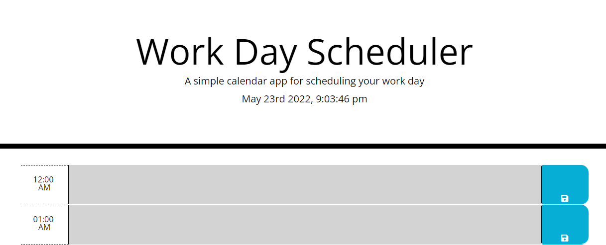
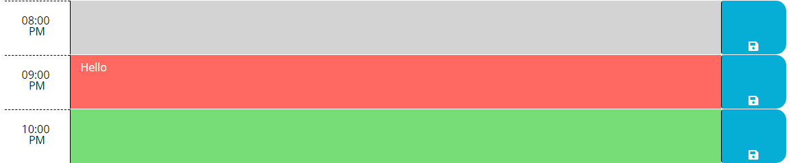

## Week 5 Homework

# Description

The main purpose of this project is to use a day-to-day task scheduler to keep track of planned events.

In this project, I have utilized APIs from Moment, jQuery, and Bootstrap. Moment provides the date and time, jQuery was used to write the .js file, and Bootstrap was used for styling the webpage.

The scheduler is designed so that there will always be the current date and time (changes with the local timezone) on the top of the page and rows of each hour in the day below the date and time. With each row of hours, the user can enter an event and save the event onto the scheduler by pressing the save button.

You may find the project [here](https://andrewplee.github.io/Week-5-homework/).

# Installation

Looking at the given .html and .css files, I knew that I had to first assign the classes provided in CSS to the elements within the HTML file.

After assigning the classes, I then look at the design of the given webpage. The webpage should display the current time and date to give the user a sense of time and day. Since this is a task scheduler, there should be a tab to indicate the hour block as well as a section for the user to write the code with color indicators for past, present, and future events. After writing it, the user should be able to save the entered schedule with a button and be pushed onto the local storage. Finally, upon refreshing the page, the saved tasks should remain on the page.

Starting with the time and day, the HTML file has a link to Moment, which gave me a clue to where I can insert the current day and time. To display the time and day on the webpage, I entered the date and time format and displayed them on the webpage as text with the seconds increasing through an interval.

The next step is to add the different sections within the hour block. My thought process is to create a container that will hold all of the hour blocks. Within each hour block, there should be a section containing the hour, a section for the text, and a section for the save button. After styling the sections with bootstrap, I moved on to the JS portion of the webpage.

Here, I knew that I will need to write conditions based on the current hour to give color indicators for past, present, and future events. After that, I will be utilizing the local storage to save the user's planned events. I wanted to code so that upon pressing the save button, the entered events will be pushed onto the local storage.

Finally, for the events to remain on the page, I will need to call the events based on the hour. To target each hour block, I decided to make the hour the key, which will take the information in the local storage and display it back in the text area part of each hour block.

# Usage

Image of the title and the current time and date displayed.

Image of the past, present, and future blocks color-coded with a task saved to the present block.

# Credit

[Moment](https://momentjs.com/) for providing the date and time

[jQuery](https://jquery.com/) for its JavaScript Library

[Bootstrap](https://getbootstrap.com/docs/4.3/getting-started/introduction/) for its frontend toolkit

# License

© 2022 Trilogy Education Services, LLC, a 2U, Inc. brand.
